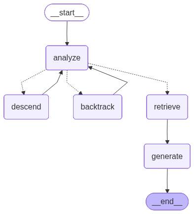

# Vectorless RAG — LangGraph Agent + PDF Document Tree

A **Retrieval-Augmented Generation (RAG)** system that answers questions from PDF documents **without vector embeddings or databases**. Instead of traditional vector similarity search, it builds a hierarchical document tree and uses an LLM-powered agent to intelligently navigate the tree structure to find relevant content.



---

## Table of Contents

- [Features](#features)
- [Tech Stack](#tech-stack)
- [GitHub Code Repository](#github-code-repository)
- [How to Use App](#how-to-use-app)
  - [Prerequisites](#prerequisites)
  - [Installation](#installation)
  - [Configuration](#configuration)
    - [DeepSeek (Recommended)](#deepseek-recommended)
    - [OpenAI](#openai)
    - [Groq (Free)](#groq-free)
  - [Running the App](#running-the-app)
- [How It Works](#how-it-works)
  - [PDF Parsing](#pdf-parsing)
  - [Tree Navigation](#tree-navigation)
  - [Backtracking](#backtracking)
- [Project Structure](#project-structure)
- [Sample Output](#sample-output)
- [License](#license)

---

## Features

- ✅ **Vectorless RAG** — No vector embeddings, no vector database, no chunking strategy tuning
- ✅ **Hierarchical Document Tree** — PDF is parsed into a navigable tree structure using layout-aware extraction
- ✅ **LangGraph State Machine** — Agent-based retrieval powered by LangGraph with structured state transitions
- ✅ **Intelligent Backtracking** — When a path yields low confidence, the agent backtracks and tries sibling nodes
- ✅ **Multi-Provider LLM Support** — Works with OpenAI, DeepSeek, and Groq (via OpenAI-compatible API)
- ✅ **One-Time PDF Parsing** — Document tree is cached to JSON after first parse for instant reuse
- ✅ **Detailed Logging** — Every LLM call logged with reasoning, confidence, latency, and token usage
- ✅ **Workflow Visualization** — Auto-generated PNG diagram of the LangGraph workflow
- ✅ **Source Citations** — Every answer includes section titles and page references
- ✅ **Zero Infrastructure** — No database, no server, no Docker — just Python and an API key

---

## Tech Stack

| Component | Technology | Purpose |
|-----------|-----------|---------|
| **Agentic Framework** | [LangGraph](https://github.com/langchain-ai/langgraph) | State graph for agent navigation and retrieval workflow |
| **LLM Client** | [OpenAI SDK](https://github.com/openai/openai-python) | Unified client for OpenAI, DeepSeek, and Groq APIs |
| **PDF Parsing** | [PyMuPDF](https://pymupdf.readthedocs.io/) + [PyMuPDF4LLM](https://github.com/pymupdf/RAG) | Layout-aware PDF to markdown conversion |
| **Data Validation** | [Pydantic](https://docs.pydantic.dev/) | Structured data models and validation |
| **Environment Management** | [python-dotenv](https://github.com/theskumar/python-dotenv) | `.env` file loading for API keys |
| **Language** | Python 3.11+ | Core runtime |

---

## GitHub Code Repository

🔗 **[https://github.com/tauseefiqbal/agentic-workflows-and-agents.git](https://github.com/tauseefiqbal/agentic-workflows-and-agents.git)**

---

## How to Use App

### Prerequisites

- Python 3.11 or higher
- An API key from one of the supported LLM providers

### Installation

1. **Clone the repository:**

   ```bash
   git clone https://github.com/tauseefiqbal/agentic-workflows-and-agents.git
   cd agentic-workflows-and-agents/RAG-Vectorless
   ```

2. **Install dependencies:**

   ```bash
   pip install -r requirements.txt
   ```

### Configuration

Create a `.env` file in the project root with your chosen provider:

#### DeepSeek (Recommended)

```env
DEEPSEEK_API_KEY=sk-your-deepseek-key
MODEL=deepseek-chat
```

#### OpenAI

```env
OPENAI_API_KEY=sk-your-openai-key
MODEL=gpt-4o-mini
```

#### Groq (Free)

```env
GROQ_API_KEY=gsk_your-groq-key
OPENAI_BASE_URL=https://api.groq.com/openai/v1
MODEL=llama-3.3-70b-versatile
```

### Running the App

```bash
python agent.py
```

The app will:

1. Download the sample PDF (Google Bigtable paper) if not present
2. Parse the PDF into a hierarchical document tree (cached after first run)
3. Generate a workflow visualization diagram
4. Answer each question in `questions.py` by navigating the tree

---

## How It Works

### PDF Parsing

The PDF is converted to markdown using **PyMuPDF4LLM**, preserving layout and heading hierarchy. Markdown headers (`#`, `##`, `###`) are parsed into a tree of `TreeNode` objects, each containing:

- Title, page range, and content
- Child nodes (subsections)
- Heading classification (numbered, unnumbered, etc.)

### Tree Navigation

A **LangGraph state machine** drives the retrieval process:

```
analyze → descend → analyze → ... → retrieve → generate → end
```

At each node, the LLM decides whether to:

- **Descend** into a child node that looks more relevant
- **Retrieve** the current node's content and generate an answer
- **Backtrack** to a parent and try a different sibling

### Backtracking

When the LLM reaches a leaf node with low confidence (< 30%), it doesn't give up. Instead, it:

1. Marks the current node as visited
2. Returns to the parent node
3. Re-analyzes remaining unvisited children
4. Tries a different path (up to 3 backtracks)

This significantly improves answer coverage compared to single-path traversal.

---

## Project Structure

```
RAG-Vectorless/
├── agent.py            # Main entry point — orchestrates the full pipeline
├── tree.py             # PDF parsing and DocumentTree construction
├── retriever.py        # LangGraph agent for tree navigation and answer generation
├── questions.py        # List of questions to answer
├── requirements.txt    # Python dependencies
├── .env                # API keys and model configuration (not committed)
├── results/
│   ├── document_tree.json   # Cached document tree (auto-generated)
│   └── workflow.png         # LangGraph workflow diagram (auto-generated)
└── retriever.log       # Detailed debug log of all LLM calls
```

---

## Sample Output

```
══════════════════════════════════════════════════════════════════════
  Vectorless RAG — Google Bigtable (no PageIndex)
══════════════════════════════════════════════════════════════════════

──────────────────────────────────────────────────────────────────────
  Q: How does Bigtable's data model work?
──────────────────────────────────────────────────────────────────────

  [Reasoning]  The Data Model section directly explains Bigtable's data model.
  [Confidence] 95%
  [Path]       root → Bigtable_A_Distribut_0 → 2_Data_Model_22

  [Answer]
  Bigtable's data model is a sparse, distributed, persistent
  multidimensional sorted map, indexed by a row key, column key,
  and a timestamp (2 Data Model, Pages 1-1).

══════════════════════════════════════════════════════════════════════
  Done: 5/5 questions answered successfully
══════════════════════════════════════════════════════════════════════
```

---

## License

This project is open source and available under the [MIT License](LICENSE).
